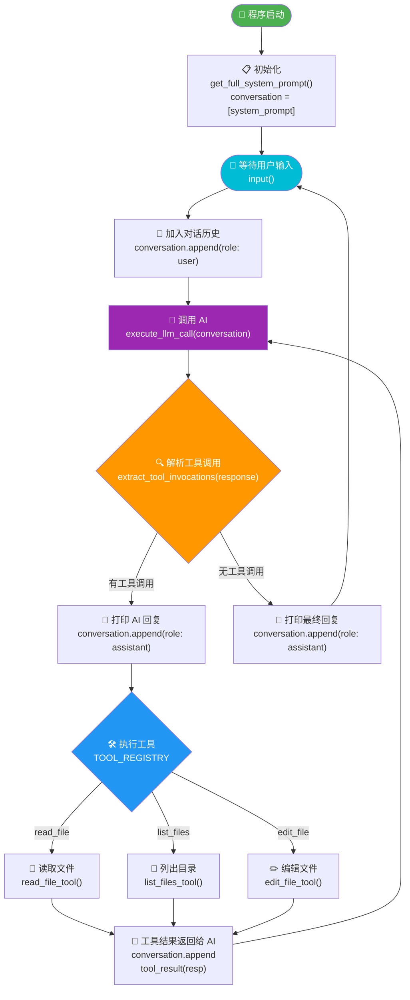

```mermaid
flowchart TD
    A([🚀 程序启动]) --> B

    B["📋 初始化<br/>get_full_system_prompt()<br/>conversation = [system_prompt]"]
    B --> C

    C(["💬 等待用户输入<br/>input()"])
    C --> D

    D["📨 加入对话历史<br/>conversation.append(role: user)"]
    D --> E

    E["🤖 调用 AI<br/>execute_llm_call(conversation)"]
    E --> F

    F{"🔍 解析工具调用<br/>extract_tool_invocations(response)"}

    F -- "有工具调用" --> G
    F -- "无工具调用" --> H

    G["📢 打印 AI 回复<br/>conversation.append(role: assistant)"]
    G --> I

    I{"🛠️ 执行工具<br/>TOOL_REGISTRY"}
    I -- "read_file" --> J1["📖 读取文件<br/>read_file_tool()"]
    I -- "list_files" --> J2["📁 列出目录<br/>list_files_tool()"]
    I -- "edit_file" --> J3["✏️ 编辑文件<br/>edit_file_tool()"]

    J1 & J2 & J3 --> K

    K["📩 工具结果返回给 AI<br/>conversation.append<br/>tool_result(resp)"]
    K --> E

    H["💬 打印最终回复<br/>conversation.append(role: assistant)"]
    H --> C

    style A fill:#4CAF50,color:#fff
    style F fill:#FF9800,color:#fff
    style I fill:#2196F3,color:#fff
    style E fill:#9C27B0,color:#fff
    style C fill:#00BCD4,color:#fff
```

